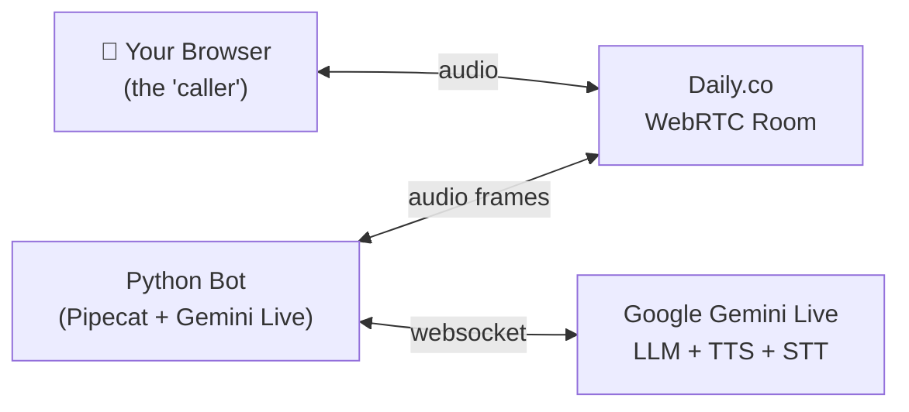

# Voice AI Agent — Learning Project

A real-time voice AI agent that mirrors the architecture of LibMIA at every layer.
Built with Python + Pipecat + Gemini Live + Daily.co.

---

## Architecture Overview



A browser tab is your phone. A Python process is the AI agent.
Both meet inside a Daily.co WebRTC room. Gemini Live handles everything:
it listens to your voice, thinks, and speaks back — all in real time.

> This mirrors LibMIA's architecture minus Twilio, Orkes, and multi-process complexity.

---

## Tech Stack

| Component | LibMIA Uses | This App Uses | Notes |
|---|---|---|---|
| Pipeline engine | Pipecat 1.1.0 | Same | Same package |
| Transport | Daily.co | Same | Same |
| LLM + TTS + STT | Gemini Live (Vertex AI) | Gemini Live (AI Studio) | Simpler API key |
| VAD | Silero | Same | Works on Mac |
| Noise reduction | Krisp | **Skipped** | Linux-only binary |
| PSTN dialing | Twilio | **Skipped** | Not needed for learning |
| Workflow engine | Orkes/Conductor | **Skipped** | Not needed for learning |
| Multi-process pipes | ForkPipe | Simplified (asyncio tasks) | Learn the concept first |

---

## Prerequisites

Get these free accounts before touching code (~5 minutes):

1. **Google AI Studio** → [aistudio.google.com](https://aistudio.google.com)
   - Click **"Get API Key"** → copy it

2. **Daily.co** → [daily.co](https://daily.co)
   - Sign up free → Dashboard → **Developers** → copy your API key

---

## Quick Start

```bash
# 1. Install dependencies
pip install -e .

# 2. Add your API keys
open .env   # paste GOOGLE_API_KEY and DAILY_API_KEY

# 3. Run the bot
python src/run.py
```

A URL will be printed. **Open that URL in Chrome or Firefox — that's your phone call.** Talk to the bot.

---

## Project Structure

```
voice-agent/
├── pyproject.toml
├── .env                    # Your real API keys (never commit this)
├── .env.example            # Safe-to-commit key template
├── .gitignore
├── README.md
└── src/
    ├── __init__.py
    ├── run.py                      # Entry point
    ├── bot_core.py                 # Pipeline orchestrator
    ├── prompt_provider.py          # System prompt + tool schemas
    ├── tool_template.py            # Tool call handlers + ExecutionStrategy
    ├── observers.py                # Latency + interruption observers
    ├── config/
    │   └── settings_layer.py       # Cached config mixin (mirrors BotCoreSettingsLayer)
    ├── swarm/
    │   ├── swarm_context.py        # Ring buffer of conversation history
    │   ├── swarm_agent.py          # Specialist agent base + PaymentsAgent
    │   └── swarm_coordinator.py    # Agent routing + hot-swap of system prompt
    ├── pipes/
    │   └── detection_pipe.py       # Simplified ForkPipe (asyncio.Task version)
    └── utils/
        └── daily_room.py           # Daily.co REST API helpers
```

---

## LibMIA Equivalence Map

| This App | LibMIA Equivalent | LibMIA File |
|---|---|---|
| `BotCore` | `BotCore` + `OutboundBotCore` | `libmia/common/core/BotCore.py` |
| `ConfigSettingsLayer` | `BotCoreSettingsLayer` | `libmia/common/core/BotCoreSettingsLayer.py` |
| `PromptProvider` | `PromptProvider` | `libmia/common/core/providers/PromptProvider.py` |
| `ToolTemplate` | `ToolTemplate` | `libmia/common/core/tools/ToolTemplate.py` |
| `ExecutionStrategy` | `ExecutionStrategy` | `libmia/common/core/tools/ExecutionStrategy.py` |
| `SwarmContext` (deque) | `SwarmContext` (shared memory ring buffer) | `libmia/llm/swarm/context/SwarmContext.py` |
| `SwarmAgent` | `SwarmAgent` | `libmia/llm/swarm/SwarmAgent.py` |
| `DetectionPipe` (asyncio.Task) | `ForkPipe` (subprocess) | `libmia/common/pipes/ForkPipe.py` |
| `on_classification` callback | `BifrostClient.send_event(HumanDetectedEvent())` | `libmia/common/core/communication/` |
| `run.py` | `CallHandlerInitializer` + `ConductorPollingClient` | `libmia/orkes/` |
| Daily.co room (browser join) | Twilio PSTN → Daily.co SIP bridge | `libmia/common/core/bots/OutboundBotCore.py` |

---

## Build Phases

### Phase 0 — Environment Setup

```bash
# Install Python 3.12 via pyenv (safe — won't break system Python)
brew install pyenv
pyenv install 3.12.9
pyenv global 3.12.9
echo 'export PATH="$(pyenv root)/shims:$PATH"' >> ~/.zshrc
source ~/.zshrc

python --version  # → Python 3.12.x
```

---

### Phase 1 — Working Bot

**What you build:** End-to-end pipeline. Browser → Daily → Pipecat → Gemini Live → back.

**Key files:** `run.py`, `bot_core.py`, `prompt_provider.py`, `tool_template.py`, `utils/daily_room.py`

**Run it:**
```bash
python src/run.py
# → Prints a URL → Open in Chrome → Talk!
```

**Pattern learned:** `BotCore.run()` calls `build_prompt_provider()` → `build_pipeline()` → `PipelineRunner.run(task)`.
This is the same call sequence as LibMIA's `BotCore`.

---

### Phase 2 — Config Layer

**What you build:** `ConfigSettingsLayer` — a mixin where every class reads settings
from a `config: dict` using `@cached_property`.

**Pattern learned:**
```
BotCore(config)
  └─ inherits ConfigSettingsLayer
       ├─ self.bot_name           (cached_property)
       ├─ self.google_api_key     (cached_property, raises if missing)
       ├─ self.vad_start_secs     (cached_property, default 0.2)
       ├─ self.vad_stop_secs      (cached_property, default 0.8)
       ├─ self.allow_interruptions (cached_property, default True)
       └─ self.max_call_duration_seconds (cached_property, default 300)
```

`@cached_property` means each setting is parsed from the dict **exactly once per instance**.
This is identical to LibMIA's `BotCoreSettingsLayer` mixin chain.

---

### Phase 3 — Tool Calling + ExecutionStrategy

**What you build:** `ExecutionStrategy.with_interruption_guard` — a decorator that cancels
a tool call if the user speaks before the tool runs.

**How it works:**
```
User stops speaking
  → LLM decides to call get_current_time
  → ExecutionStrategy waits up to 2 seconds
  → If user speaks again within 2s → return "Cancelled — you interrupted."
  → If silent for 2s → run the real tool
```

**Also builds:**
- `LatencyObserver` — logs bot response latency (user stops → bot starts)
- `InterruptionObserver` — watches `VADUserStartedSpeakingFrame` to set the interruption event

**Pattern learned:** In LibMIA, `ExecutionStrategy.with_wait_for_interruption` guards every
LLM tool call to prevent expensive API calls when the user already said "never mind".

---

### Phase 4 — Swarm Agents

**What you build:** A transfer pattern where the root LLM hands off to a specialist agent
with its own system prompt, tools, and shared conversation context.

**Components:**

| Class | Responsibility |
|---|---|
| `SwarmContext` | Ring buffer (deque) of the last N conversation turns |
| `SwarmAgent` | Abstract specialist with its own prompt + tools |
| `PaymentsSwarmAgent` | Concrete specialist: handles payment status lookups |
| `SwarmCoordinator` | Routes tool calls, activates/deactivates agents, hot-swaps the system prompt |

**Transfer flow:**
```
User: "I have a question about my payment"
  → Root LLM calls transfer_to_agent(agent_name="payments")
  → SwarmCoordinator.activate_agent("payments")
  → llm.update_system_instruction(payments_prompt + conversation_history)
  → All tool calls now route to PaymentsSwarmAgent
  → User: "actually never mind" → return_to_main_agent restores original prompt
```

**Pattern learned:** In LibMIA, `SwarmPipe` runs in a **separate subprocess**.
`SwarmContext` uses `multiprocessing.shared_memory` so agents in different processes
share the same transcript. Here we skip the multiprocessing — the routing logic is identical.

---

### Phase 5 — ForkPipe (The Core Concept)

**What you build:** `DetectionPipe` — a background classifier that runs in parallel
with the main conversation without blocking it.

**How DetectionPipe works:**
```
Transport audio frames
  → feed_audio(bytes) → asyncio.Queue
  → background Task accumulates ~3s of audio
  → _classify() → ("human", 0.95) or ("voicemail", 0.99) or ("silence", 0.99)
  → on_classification callback → BotCore reacts
```

**Why LibMIA uses a subprocess instead of asyncio.Task:**

> Gemini Live uses gRPC which holds the Python GIL and blocks the event loop.
> A subprocess gets its own GIL and its own event loop, so the main conversation
> is never blocked by the classifier running in parallel.

**LibMIA's full ForkPipe tree (OutboundBotCore):**
```
IVRDetectionPipe
  └─ VoicemailDetectionPipe
       └─ on HumanDetectedEvent (Bifrost) → ChatPipe unmutes
```

- Detection pipes: `has_return_pipe=False` (fire and forget)
- ChatPipe: `has_return_pipe=True` (LLM response audio comes back)
- Each pipe has `shutdown_on=` a Bifrost event for clean teardown

**Frame filtering:** ForkPipe has `input_frame_filter` and `output_frame_filter` —
it only forwards specific frame types to the child (audio, VAD frames) and only accepts
specific types back (detection result frames). This prevents flooding the child with
irrelevant frames.

---

## The Core Mental Model

Everything in both this app and LibMIA answers the same question at every step:

> **What type of frame is this, and where should it go next?**

| Frame Type | Goes To |
|---|---|
| `VADUserStartedSpeakingFrame` | LLM + InterruptionObserver + DetectionPipe |
| `VADUserStoppedSpeakingFrame` | LLM + LatencyObserver |
| `BotStartedSpeakingFrame` | LatencyObserver (records latency) |
| `TTSAudioRawFrame` | Transport output (plays to user) |
| `FunctionCallResultFrame` | LLM (tool result fed back) |
| `HumanDetectedEvent` (Bifrost) | ChatPipe unmutes, detection pipes shut down |

Once you see everything as typed messages flowing through filters, the whole architecture clicks.

---

## Environment Variables

| Key | Required | Default | Description |
|---|---|---|---|
| `GOOGLE_API_KEY` | ✅ Yes | — | Google AI Studio key |
| `DAILY_API_KEY` | ✅ Yes | — | Daily.co API key |
| `BOT_NAME` | No | `VoiceBot` | Display name in the room |
| `VAD_START_SECS` | No | `0.2` | Seconds of speech before VAD triggers |
| `VAD_STOP_SECS` | No | `0.8` | Seconds of silence before user is "done" |
| `ALLOW_INTERRUPTIONS` | No | `true` | Whether user can interrupt the bot |
| `MAX_CALL_DURATION_SECONDS` | No | `300` | Auto-hangup after this many seconds |
| `SYSTEM_INSTRUCTION_OVERRIDE` | No | — | Override the system prompt at runtime |

---

## Running Tests

```bash
python -m pytest tests/ -v
```
